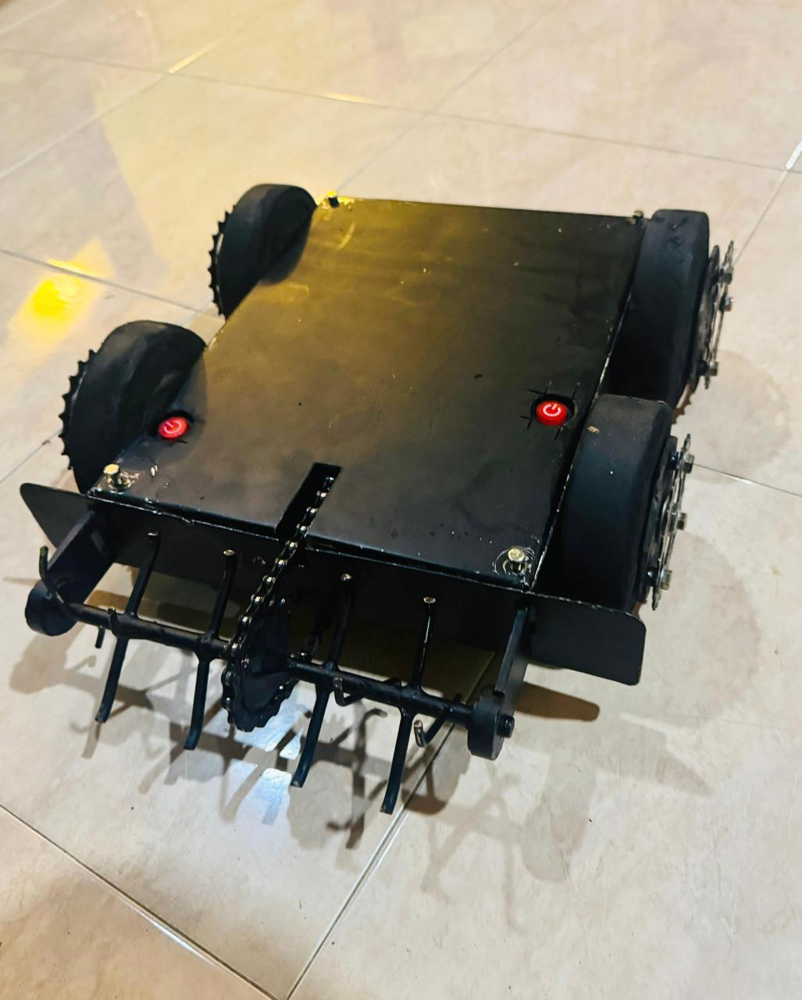

# Battle Robot Platform -- (Version 1.0)
# [TERMINATOR] - A Combat Robot Project 🤖

## Project Overview ✨

Designed and built a battle robot capable of competing in combat robotics competitions. This project focused on creating a functional robot designed to compete in combat matches, showcasing engineering and design capabilities. `[Your Robot's Name]` is a **[e.g., vertical spinner, horizontal spinner, flipper, etc.]** robot built to be durable, powerful, and agile.

  

---

## Key Features 🌟

*   **💥 Powerful Weapon:** [Briefly describe the weapon, e.g., A hardened S7 tool steel bar spinning at 8000 RPM.]
*   **🛡️ Durable Armor:** [Describe the armor, e.g., Constructed with 5mm thick AR500 steel plates to withstand heavy impacts.]
*   **💨 Agile Drivetrain:** [Describe the drive system, e.g., A two-wheel drive system powered by high-torque brushless motors, allowing for quick maneuverability.]
*   **🔩 Robust Chassis:** [Describe the frame, e.g., A unibody chassis milled from a single block of 6061 aluminum for maximum rigidity.]

---

## Hardware Components 🧰

The following table details the core components used in the construction of `[Your Robot's Name]`.

| Category                  | Component                                | Quantity | Purpose / Notes                                                               |
| ------------------------- | ---------------------------------------- | :------: | ----------------------------------------------------------------------------- |
| **⚙️ Drivetrain**         | Brushless Motors (e.g., 2207 2500KV)     |    2     | Powers the wheels. Chosen for their high power-to-weight ratio.               |
|                           | Wheels (e.g., 3-inch Foam Wheels)        |    2     | Provides traction and absorbs shock. Foam is great for grip on arena floors.  |
|                           | Drive ESCs (e.g., BLHeli_32 35A)         |    2     | Electronic Speed Controllers for precise control of the drive motors.         |
| **⚔️ Weapon System**      | Weapon Motor (e.g., DYS 5055 700KV)      |    1     | Powers the main weapon. Selected for high torque to get the weapon to speed.    |
|                           | Weapon ESC (e.g., Hobbywing FlyFun 80A)  |    1     | A robust ESC to handle the high current draw of the weapon motor.             |
|                           | Weapon (e.g., S7 Tool Steel Bar)         |    1     | The primary point of contact. Hardened S7 steel for impact resistance.        |
| **🛡️ Chassis & Armor**    | Chassis Material (e.g., 6061 Aluminum)  |    1     | The main frame of the robot, housing all internal components.                 |
|                           | Armor Plating (e.g., AR500 Steel)        |    4     | Protects the robot's internals from opponent attacks.                         |
|                           | Fasteners (e.g., M3 & M4 Steel Screws)   |  ~50     | Holds the robot together under extreme stress.                                |
| **⚡ Electronics & Control**| Battery (e.g., 4S 1500mAh LiPo)          |    1     | Powers the entire robot. 4S provides a good balance of voltage and weight.      |
|                           | Radio Receiver (e.g., FlySky FS-iA6B)    |    1     | Receives signals from the transmitter to control the robot.                   |
|                           | Radio Transmitter (e.g., FlySky FS-i6)   |    1     | The handheld remote control used to operate the robot during a match.         |
|                           | Power Switch (e.g., XT90-S Anti-Spark)   |    1     | Safely connects and disconnects battery power to the entire system.           |
|                           | Power Distribution Board (PDB)           |    1     | Distributes power from the battery to the various ESCs and electronics.       |

---

## Explanation of Hardware Categories 🤔

Each category of components serves a critical function in the robot's design and performance.

### ⚙️ Drivetrain
The drivetrain is the robot's mobility system. It is responsible for all movement within the arena, including acceleration, turning, and positioning. A powerful and reliable drivetrain is crucial for outmaneuvering opponents and controlling the flow of the match. Our design uses two independent brushless motors, allowing for precise "tank-style" steering.

### ⚔️ Weapon System
This is the primary offensive system of the robot. Its goal is to disable or destroy the opposing robot. The system consists of a high-torque motor to spin the weapon, a robust speed controller (ESC) to handle the power, and the weapon itself, which is designed for maximum impact and durability.

### 🛡️ Chassis & Armor
The chassis is the robot's skeleton, providing structural integrity and a mounting point for all other components. The armor is the robot's skin, designed to protect the vulnerable internals from the kinetic energy of opponent attacks. The choice of materials (like Aluminum for the frame and AR500 steel for armor) is a trade-off between weight, cost, and durability.

### ⚡ Electronics & Control
This category represents the "brains" and "nervous system" of the robot.
*   **Battery:** The heart of the robot, providing the electrical power needed for all systems. We use a Lithium Polymer (LiPo) battery for its high energy density.
*   **Radio System:** The radio transmitter and receiver form the communication link, allowing the driver to control the robot remotely.
*   **Power Control:** The power switch and distribution board ensure that power is managed safely and delivered efficiently to where it's needed.

---

## Build & Competition History 🏆

### Build Log 🛠️
<!-- Optional: Link to a blog post, forum thread, or photo gallery documenting your build process. -->
A detailed build log with more pictures can be found here: [Link to Build Log]

### Competition Results 🏅
*   **[Event Name] [Year]:** [e.g., Placed 3rd, Went 2-2, Rookie of the Year]
*   **[Another Event] [Year]:** [e.g., Qualified for Quarterfinals]

---

## Future Improvements 🚀

*   **Weapon Upgrade:** Move to a wider and thicker weapon bar for increased impact energy.
*   **Weight Reduction:** Optimize the chassis design to remove unnecessary material, allowing for thicker armor.
*   **Improved Drivetrain:** Experiment with different wheel types to improve grip and durability.

---

## License 📜

This project is licensed under the MIT License - see the [LICENSE.md](LICENSE.md) file for details.

---

## Acknowledgments 🙏

*   Thanks to the **[Your University/Club Name]** for providing the workspace and tools.
*   Shoutout to the combat robotics community at **[e.g., r/battlebots, SPARC]** for their invaluable advice.
*   [Any other acknowledgments, e.g., sponsors, mentors, etc.]
