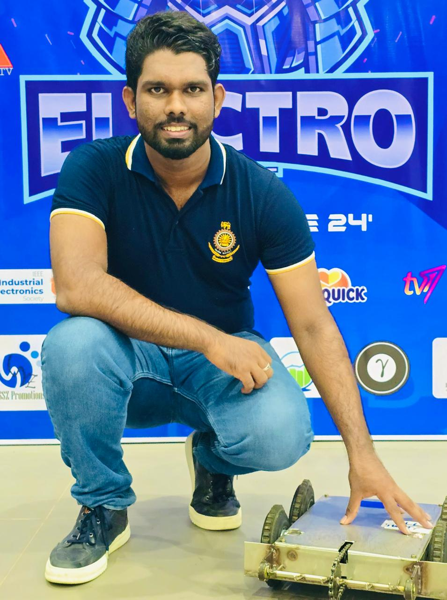

# Battle Robot Platform -- (Version 1.0)
# TERMINATOR - A Combat Robot Project 🤖

## Project Overview ✨

Designed and built a battle robot capable of competing in combat robotics competitions. This project focused on creating a functional robot designed to compete in combat matches, showcasing engineering and design capabilities.

  

---
## Meet the Team 👋

This robot was brought to life by a passionate team of builders from **Team JASPERN**. The core team includes:

*   **Jeewantha Sadaruwan**
*   **Nuwantha Senadhi Ranaweera**
*   **Pasidu Pahasara**
*   **Minura Ashen Samaramanna**

  

---

## Key Features 🌟

*   **💥 Powerful Weapon:** A custom-built vertical drum spinner designed to tear into opponents and control the match.
*   **🛡️ Durable Armor:** Constructed with tough steel plates to withstand the brutal impacts of combat.
*   **💨 Agile Drivetrain:** A robust two-wheel drive system powered by geared 550-size DC motors for high torque and pushing power.
*   **🔩 Robust Chassis:** A custom-fabricated chassis built from white steel, providing a strong and rigid frame.

---

## Hardware Components 🧰

The following table details the core components used in the construction of `[Your Robot's Name]`.

| Category                  | Component                                | Quantity | Purpose / Notes                                                               |
| ------------------------- | ---------------------------------------- | :------: | ----------------------------------------------------------------------------- |
| **⚙️ Drivetrain**         | 550-Size Brushed DC Motors (with Gearboxes) |    2     | Powers the wheels. Geared for high torque and pushing power.                    |
|                           | Wheels (e.g., 4-inch Colson Wheels)      |    2     | Provides traction on the arena floor. *(Update with your wheel type)*          |
|                           | Brushed Motor ESCs (e.g., 60A)           |    2     | Provides smooth, precise control for the brushed drive motors.                  |
| **⚔️ Weapon System**      | High-Torque DC Motor (e.g., 775-size)    |    1     | Powers the vertical drum spinner. *(Update with your motor model)*              |
|                           | High-Current Brushed ESC (e.g., 100A)    |    1     | A robust ESC to handle the high current draw of the weapon motor.             |
|                           | Vertical Steel Drum Spinner              |    1     | The primary offensive tool, designed to store and deliver kinetic energy.     |
| **🛡️ Chassis & Armor**    | White Steel Frame                        |    1     | The main frame of the robot, housing all internal components.                 |
|                           | Steel Armor Plating                      |   ~4     | Protects the robot's internals from opponent attacks.                         |
|                           | Fasteners (e.g., M4 & M5 Steel Screws)   |  ~50     | Holds the robot together under the extreme stress of combat.                  |
| **⚡ Electronics & Control**| Drive Battery ([XS] 5000mAh 40C LiPo)    |    1     | Dedicated high-capacity battery for the drivetrain. *(Fill in cell count, e.g., 3S)* |
|                           | Weapon Battery ([YS] 1000mAh 20C LiPo)   |    1     | Separate, lightweight battery for the weapon system. *(Fill in cell count, e.g., 4S)* |
|                           | Radio Receiver (e.g., FlySky FS-iA6S)    |    1     | Receives signals from the transmitter to control the robot.                   |
|                           | Radio Transmitter (FlySky FS-i6S)        |    1     | The handheld remote control used to operate the robot during a match.         |
|                           | Power Switch (e.g., XT90-S Anti-Spark)   |    2     | Safely connects and disconnects power for the drive and weapon systems.       |

---

## Explanation of Hardware Categories 🤔

Each category of components serves a critical function in the robot's design and performance.

### ⚙️ Drivetrain
The drivetrain is the robot's mobility system. It is responsible for all movement within the arena. A powerful and reliable drivetrain is crucial for outmaneuvering opponents. Our design uses two independent **brushed 550-size DC motors with gearboxes**, which provide excellent torque for pushing and precise "tank-style" steering.

### ⚔️ Weapon System
This is the primary offensive system of the robot. Its goal is to disable or destroy the opposing robot. Our system features a **vertical drum spinner**, powered by its own high-torque DC motor. This design allows us to deliver powerful, focused hits and disrupt our opponents.

### 🛡️ Chassis & Armor
The chassis is the robot's skeleton, and the armor is its skin. Our robot is built around a **custom white steel chassis** for maximum rigidity. This frame is protected by **steel armor plates**, chosen for their durability and ability to withstand heavy impacts from other robots.

### ⚡ Electronics & Control
This category represents the "brains" and "nervous system."
*   **Dual Battery System:** We use a dual-battery configuration: a large **5000mAh LiPo** for the high-demand drivetrain and a separate **1000mAh LiPo** for the weapon. This isolates the systems and prevents power sags to the drive motors when the weapon hits.
*   **Radio System:** The **FlySky FS-i6S** transmitter and receiver form the communication link, allowing the driver to control the robot remotely with precision.
*   **Power Control:** We use **brushed ESCs** to ensure smooth and responsive control over both the drive and weapon motors. Separate power switches for each system ensure safe operation.

## Build & Competition History 🏆

  

### Competition Results 🏅
*   **Top 10 - ElecroCombat Robot Battle Competition 2024**
*   **Top 10 - LethalBot Robot Battle Competition 2024**

---

## Future Improvements 🚀

*   **Weapon Upgrade:** Move to a wider and thicker weapon bar for increased impact energy.
*   **Weight Reduction:** Optimize the chassis design to remove unnecessary material, allowing for thicker armor.
*   **Improved Drivetrain:** Experiment with different wheel types to improve grip and durability.

---

